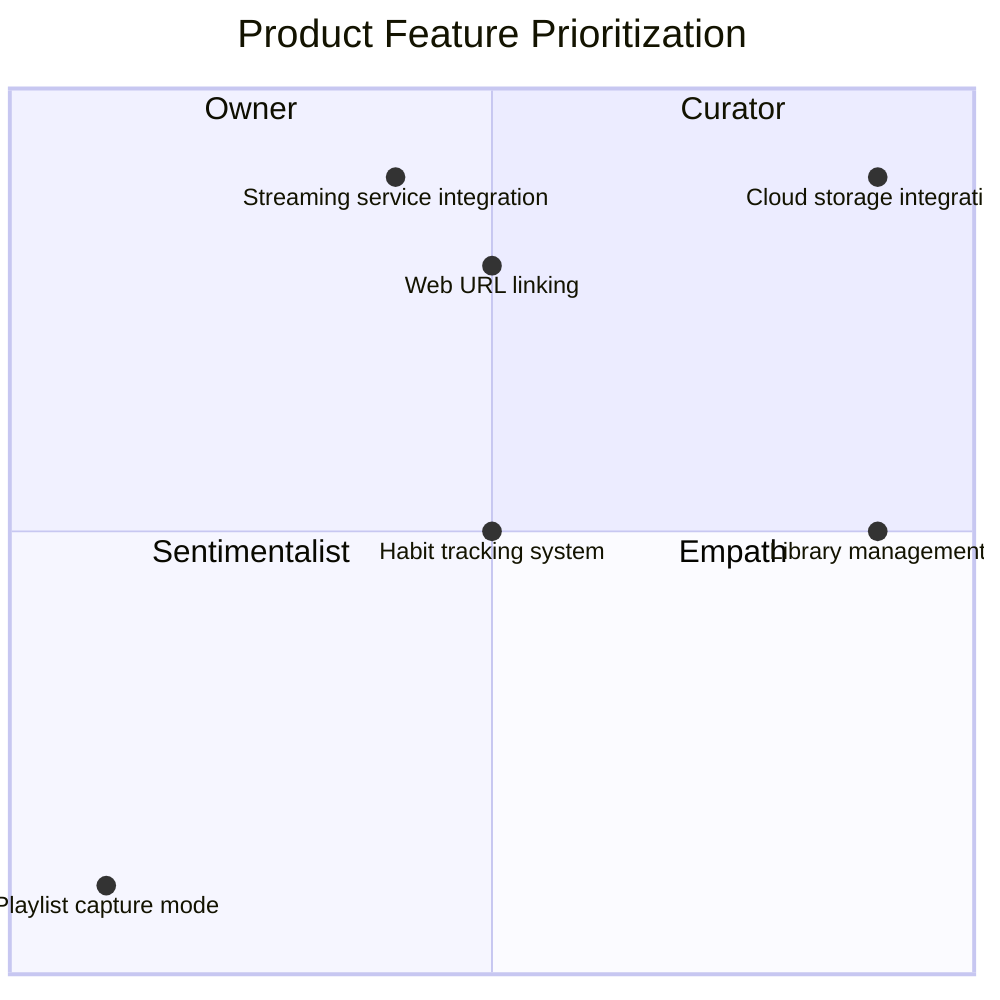

# 1. Overview & Purpose

## 1.1 Product Summary

*Describe what the product is, its role, and the core problem it solves.*

> Northstar is a music library manager and streaming hub, meaning it does not store song files directly. Instead, it manages text-based data—such as playlists, artists, albums, and tags—while linking songs to external streaming providers.
> 
> 
> ---
> 

> Northstar functions as a
> 
> 
> ---
> 
> - *Northstar functions as a music habit-tracking system; by monitoring listening patterns and preferences, it provides personalized recommendations for playlist management and the discovery of similar artists, albums, and songs.*
> - A note taking app — you can add personal notes/observations to each data type (artist, album, playlist, track, tag) to give it more meaning, to encourage experience, not mindless consumption.

> Northstar differs from other products on the market by providing users with tools to tap into the emotional modalities that music offers. The ownership a user has over their music library in Northstar is multi-dimensional, enabling unique control over how they choose to experience music.
> 
> 
> ---
> 
> emotional modality — refers to the different ways or "modes" through which emotions are expressed, perceived, or categorized
> 

## 1.2 User Persona

### Curator

Someone that:

- values collecting and curating songs and artists, and prefers their music library over the mainstream radio
- wants to manage their library with full control and flexibility

> does not want to rely on a streaming service to
> 

### Sentimentalist

Someone that:

- values experience, not consumption
- wants to capture a moment in time to relive them again
- experiences music through emotional modalities, has specific music listening habits for specific moods

### Sovereign Explorer

Someone that:

- likes to explore music on their own terms, not through a generalized algorithm

## 1.3 Scope of This Document

*Clarify what is included, excluded, and deferred.*

## 1.4 Business Value

Northstar is offered in two packages:

<aside>

**Free**

- Store library data on device
- Basic + Advanced library management
- Unlimited number of devices
- Social features
    - Library sharing
- One service integration
</aside>

<aside>

**Paid**

Everything in free plus:

- Northstar Cloud library storage for backup and easy syncing between devices
- Multiple service integrations
- **`AI`** Habit tracking system —  personalized recommendations for playlist management and the discovery of similar artists, albums, and songs
</aside>

### Analysis and reasoning behind offer decisions

- Library storage
    - On-device
    - Northstar Cloud
        
        > Test business value
        > 
        > 
        > Required for AI Habits?
        > 
- Basic + Advanced library management
- Unlimited number of devices
    
    > user will have to manually set up library syncing through a 3rd party cloud provider
    > 
- Service integrations
    
    User can have a single 3rd party service integration active at one time. They can disable any active integration and connect another one at any time.
    
    Why? Because it actively hinders Northstar application exploration and usage to deny users completely of trying out a different service integration.
    
- **`AI`** Habit tracking system
- Social features

## 1.5 Document Conventions

Define formatting for notes, TBDs, etc.

Example:

- | = personal note / idea
- `ASSUMPTION` = believed true but must be validated