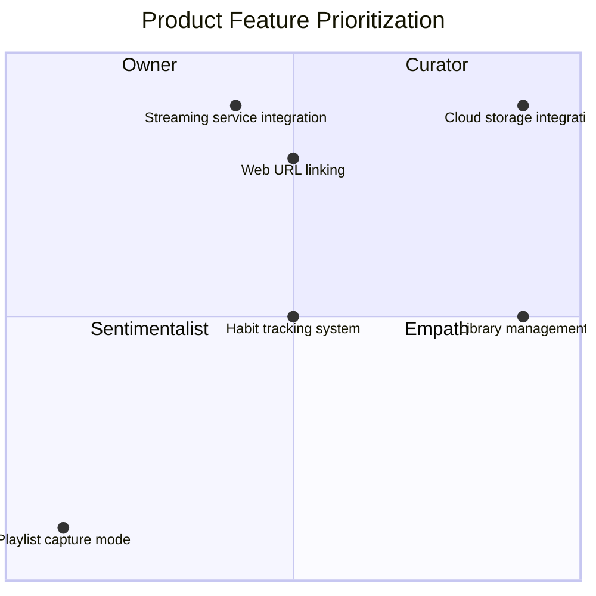

# 1. Overview & Purpose

---

## 1.1 Product Summary

*Describe what the product is, its role, and the core problem it solves.*

> Northstar is a music library manager and streaming hub, meaning it does not store song files directly. Instead, it manages text-based data—such as playlists, artists, albums, and tags—while linking songs to external streaming providers.
> 
> 
> ---
> 

> Northstar functions as a
> 
> 
> ---
> 
> - *Northstar functions as a music habit-tracking system; by monitoring listening patterns and preferences, it provides personalized recommendations for playlist management and the discovery of similar artists, albums, and songs.*
> - A note taking app — you can add personal notes/observations to each data type (artist, album, playlist, track, tag) to give it more meaning, to encourage experience, not mindless consumption.

> Northstar differs from other products on the market by providing users with tools to tap into the emotional modalities that music offers. The ownership a user has over their music library in Northstar is multi-dimensional, enabling unique control over how they choose to experience music.
> 
> 
> ---
> 
> emotional modality — refers to the different ways or "modes" through which emotions are expressed, perceived, or categorized
> 

## 1.2 User Persona

### Curator

Someone that:

- values collecting and curating songs and artists, and prefers their music library over the mainstream radio
- wants to manage their library with full control and flexibility

> does not want to rely on a streaming service to
> 

### Sentimentalist

Someone that:

- values experience, not consumption
- wants to capture a moment in time to relive them again
- experiences music through emotional modalities, has specific music listening habits for specific moods

### Sovereign Explorer

Someone that:

- likes to explore music on their own terms, not through a generalized algorithm

## 1.3 Scope of This Document

*Clarify what is included, excluded, and deferred.*

## 1.4 Business Value

Northstar is offered in two packages:

<aside>

**Free**

- Store library data on device
- Basic + Advanced library management
- Unlimited number of devices
- Social features
    - Library sharing
- One service integration
</aside>

<aside>

**Paid**

Everything in free plus:

- Northstar Cloud library storage for backup and easy syncing between devices
- Multiple service integrations
- **`AI`** Habit tracking system —  personalized recommendations for playlist management and the discovery of similar artists, albums, and songs
</aside>

### Analysis and reasoning behind offer decisions

- Library storage
    - On-device
    - Northstar Cloud
        
        > Test business value
        > 
        > 
        > Required for AI Habits?
        > 
- Basic + Advanced library management
- Unlimited number of devices
    
    > user will have to manually set up library syncing through a 3rd party cloud provider
    > 
- Service integrations
    
    User can have a single 3rd party service integration active at one time. They can disable any active integration and connect another one at any time.
    
    Why? Because it actively hinders Northstar application exploration and usage to deny users completely of trying out a different service integration.
    
- **`AI`** Habit tracking system
- Social features

## 1.5 Document Conventions

Define formatting for notes, TBDs, etc.

Example:

- | = personal note / idea
- `ASSUMPTION` = believed true but must be validated

# 2. Core Concepts

`HORIZONTAL`

High‑level conceptual pillars of the system. These are not tied to UI or features.

Examples might include:

- Library
- Staging vs Repository
- Identity of musical objects
- Relationship hierarchy (Artist → Album → Track)
- External sources & metadata extraction

Include concise conceptual descriptions here. Longer operational details go later.

---

# 3. Data Model

`HORIZONTAL`

This section establishes the laws of the system. Every feature must obey these rules.

For each data type, use the same template below.

---

## 3.1 Track

### 3.1.1 Definition

What the object represents at a conceptual level.

### 3.1.2 Attributes

Field list with descriptions (simple text, not DB schema).

### 3.1.3 Relationships

How this type interacts with others.
(e.g., Track → Artist, Track → Album, Playlist → Track[])

### 3.1.4 Lifecycle

Creation, editing, committing, staging, deletion, merging.

### 3.1.5 Constraints

Rules the system must enforce.
(e.g., “Track must have ≥ 1 external source link”)

### 3.1.6 Edge Cases

(e.g., orphan tracks, duplicate artists)

## 3.2 Playlist

### 3.2.1 Definition

What the object represents at a conceptual level.

### 3.2.2 Attributes

Field list with descriptions (simple text, not DB schema).

### 3.2.3 Relationships

How this type interacts with others.
(e.g., Track → Artist, Track → Album, Playlist → Track[])

### 3.2.4 Lifecycle

Creation, editing, committing, staging, deletion, merging.

### 3.2.5 Constraints

Rules the system must enforce.
(e.g., “Track must have ≥ 1 external source link”)

### 3.2.6 Edge Cases

(e.g., orphan tracks, duplicate artists)

## 3.3 Artist

### 3.3.1 Definition

What the object represents at a conceptual level.

### 3.3.2 Attributes

Field list with descriptions (simple text, not DB schema).

### 3.3.3 Relationships

How this type interacts with others.
(e.g., Track → Artist, Track → Album, Playlist → Track[])

### 3.3.4 Lifecycle

Creation, editing, committing, staging, deletion, merging.

### 3.3.5 Constraints

Rules the system must enforce.
(e.g., “Track must have ≥ 1 external source link”)

### 3.3.6 Edge Cases

(e.g., orphan tracks, duplicate artists)

## 3.4 Album

### 3.4.1 Definition

What the object represents at a conceptual level.

### 3.4.2 Attributes

Field list with descriptions (simple text, not DB schema).

### 3.4.3 Relationships

How this type interacts with others.
(e.g., Track → Artist, Track → Album, Playlist → Track[])

### 3.4.4 Lifecycle

Creation, editing, committing, staging, deletion, merging.

### 3.4.5 Constraints

Rules the system must enforce.
(e.g., “Track must have ≥ 1 external source link”)

### 3.4.6 Edge Cases

(e.g., orphan tracks, duplicate artists)

## 3.5 Tag

### 3.5.1 Definition

What the object represents at a conceptual level.

### 3.5.2 Attributes

Field list with descriptions (simple text, not DB schema).

### 3.5.3 Relationships

How this type interacts with others.
(e.g., Track → Artist, Track → Album, Playlist → Track[])

### 3.5.4 Lifecycle

Creation, editing, committing, staging, deletion, merging.

### 3.5.5 Constraints

Rules the system must enforce.
(e.g., “Track must have ≥ 1 external source link”)

### 3.5.6 Edge Cases

(e.g., orphan tracks, duplicate artists)

# 4. System Architecture

`HORIZONTAL`

Not code architecture—functional architecture.

---

## 4.1 Library Spaces

- Staging — purpose, rules
- Repository — purpose, rules

## 4.2 Movement & Commit Logic

How items flow between spaces.

## 4.3 Import Sources

Manual, automatic, streaming service integrations.

## 4.4 Permissions / Data Access Characteristics

(e.g., is Repository read‑only?)

## 4.5 Bulk Operations

(e.g., bulk commit, bulk discard)

## 4.6 Error Handling & Recovery

(e.g., metadata extraction failures)

# 5. Global Functional Requirements

`HORIZONTAL`

Requirements that apply across many features.

Examples:

- Playback event triggers (`onTrackStart`, `onTrackEnd`)
- Duplicate prevention
- Metadata extraction rules
- Notification system (toasts, banners)
- User identity

Each requirement gets a clear, numbered FR ID.

---

---

**PART II — FEATURE‑SPECIFIC SECTIONS (Vertical)**

Each feature gets its own vertical section.
Use the template below for every feature (Capture Mode, Playlist Creation, Imports, Tagging, etc.)

# 6.X Feature Name

`VERTICAL`

---

## 6.X.1 Summary / Intent

Explain what the feature does and why it exists.

## 6.X.2 Primary User Goals

List key user outcomes.

## 6.X.3 Actors

Which user types or subsystems participate.

## 6.X.4 Initiation Points / Triggers

All ways the user/system can start the feature.
(e.g., global button, contextual menu, auto‑triggers)

## 6.X.5 Detailed User Flow

Step‑by‑step sequence of how the user interacts with the system.

## 6.X.6 Functional Logic

Core rules the system must implement.
This is where things like “Capture only at onTrackStart” go.

## 6.X.7 Constraints

(e.g., “Only one Capture Playlist may be active at any time”)

## 6.X.8 UI Requirements

- UI elements
- States
- Indicators
- Notifications

## 6.X.9 Settings & User Customizations

Configurable behaviors (Duplicate Prevention, thresholds, filters, etc.)

## 6.X.10 System Interactions

How this feature touches:

- Data Model
- Library (Staging / Repository)
- Playback engine
- External services

## 6.X.11 Edge Cases

(e.g., a track skipped before 0:00 should not be added)

## 6.X.12 Error Handling

Define error messages, fallback behavior, etc.

## 6.X.13 Analytics / Events (Optional)

Internal signals the system tracks (useful if needed later).

## 6.X.14 Use Case Scenarios

Narrative examples (you already wrote these for Capture Mode).

---

**PART III — CROSS-FEATURE LOGIC (Optional Horizontal Layer)**

# 7. Interactions Between Features

`HORIZONTAL`

If two features interact frequently (e.g., Capture Mode + Playlist Management), document those interactions here.

---

# 8. Edge Cases & Global Constraints

`HORIZONTAL`

System-wide exceptions that don’t belong to one specific feature.

---

# 9. Glossary

`HORIZONTAL`

Define any domain-specific terms.

---