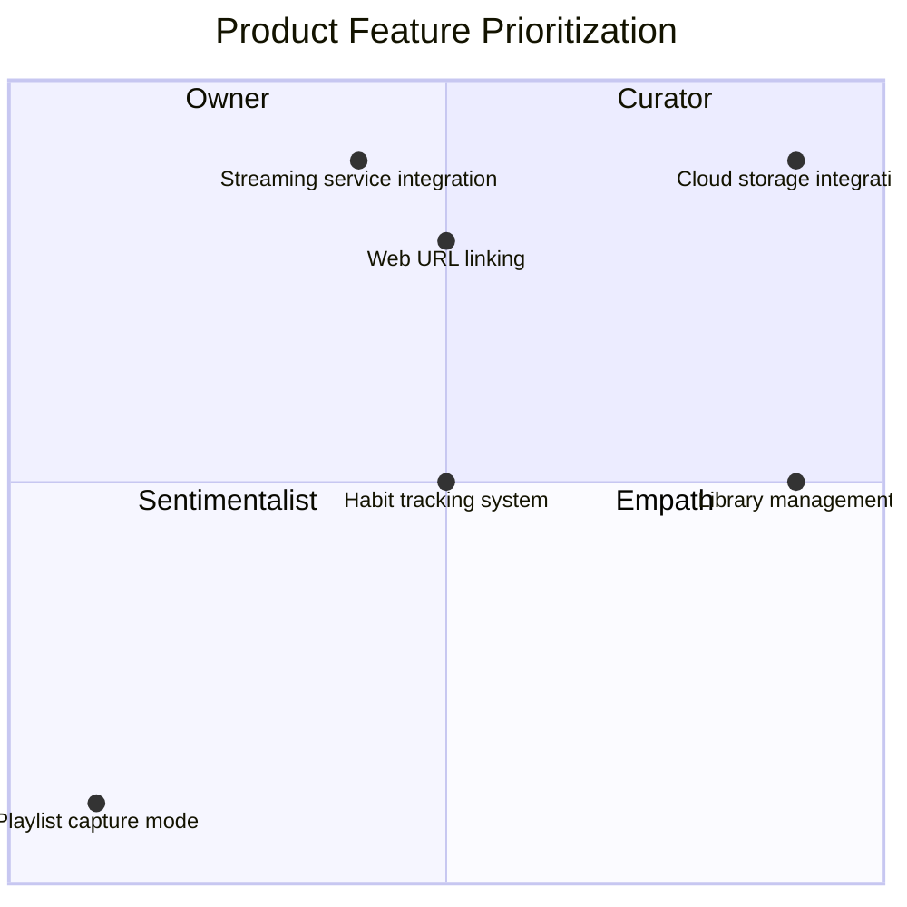

# 1. Overview & Purpose

---

## 1.1 Product Summary

*Describe what the product is, its role, and the core problem it solves.*

> Northstar is a music library manager and streaming hub, meaning it does not store song files directly. Instead, it manages text-based data—such as playlists, artists, albums, and tags—while linking songs to external streaming providers.
> 
> 
> ---
> 

> Northstar functions as a
> 
> 
> ---
> 
> - *Northstar functions as a music habit-tracking system; by monitoring listening patterns and preferences, it provides personalized recommendations for playlist management and the discovery of similar artists, albums, and songs.*
> - A note taking app — you can add personal notes/observations to each data type (artist, album, playlist, track, tag) to give it more meaning, to encourage experience, not mindless consumption.

> Northstar differs from other products on the market by providing users with tools to tap into the emotional modalities that music offers. The ownership a user has over their music library in Northstar is multi-dimensional, enabling unique control over how they choose to experience music.
> 
> 
> ---
> 
> emotional modality — refers to the different ways or "modes" through which emotions are expressed, perceived, or categorized
> 

## 1.2 User Persona

### Curator

Someone that:

- values collecting and curating songs and artists, and prefers their music library over the mainstream radio
- wants to manage their library with full control and flexibility

> does not want to rely on a streaming service to
> 

### Sentimentalist

Someone that:

- values experience, not consumption
- wants to capture a moment in time to relive them again
- experiences music through emotional modalities, has specific music listening habits for specific moods

### Sovereign Explorer

Someone that:

- likes to explore music on their own terms, not through a generalized algorithm

## 1.3 Scope of This Document

*Clarify what is included, excluded, and deferred.*

## 1.4 Business Value

Northstar is offered in two packages:

<aside>

**Free**

- Store library data on device
- Basic + Advanced library management
- Unlimited number of devices
- Social features
    - Library sharing
- One service integration
</aside>

<aside>

**Paid**

Everything in free plus:

- Northstar Cloud library storage for backup and easy syncing between devices
- Multiple service integrations
- **`AI`** Habit tracking system —  personalized recommendations for playlist management and the discovery of similar artists, albums, and songs
</aside>

### Analysis and reasoning behind offer decisions

- Library storage
    - On-device
    - Northstar Cloud
        
        > Test business value
        > 
        > 
        > Required for AI Habits?
        > 
- Basic + Advanced library management
- Unlimited number of devices
    
    > user will have to manually set up library syncing through a 3rd party cloud provider
    > 
- Service integrations
    
    User can have a single 3rd party service integration active at one time. They can disable any active integration and connect another one at any time.
    
    Why? Because it actively hinders Northstar application exploration and usage to deny users completely of trying out a different service integration.
    
- **`AI`** Habit tracking system
- Social features

## 1.5 Document Conventions

Define formatting for notes, TBDs, etc.

Example:

- | = personal note / idea
- `ASSUMPTION` = believed true but must be validated

# 2. Core Concepts

`HORIZONTAL`

High‑level conceptual pillars of the system. These are not tied to UI or features.

Examples might include:

- Library
- Staging vs Repository
- Identity of musical objects
- Relationship hierarchy (Artist → Album → Track)
- External sources & metadata extraction

Include concise conceptual descriptions here. Longer operational details go later.

---

# 3. Data Model

`HORIZONTAL`

This section establishes the laws of the system. Every feature must obey these rules.

For each data type, use the same template below.

---

## 3.1 Track

### 3.1.1 Definition

A track is the most granular unit of data in Northstar, representing a single audio file or stream. It contains only the metadata that identifies what the song is, not the actual digital audio data itself. The track serves as the fundamental building block of the library, linking user-curated metadata to external audio sources.

### 3.1.2 Attributes

- **Title**: The name of the track
- **Duration**: Length of the track in seconds or milliseconds
- **File Path or URL**: Reference to the external audio source location
- **Artist ID**: Unique identifier linking the track to its artist
- **Album ID**: Unique identifier linking the track to its album
- **External Source Links**: One or more URLs to external streaming services or audio sources associated with the user's account
- **Tags**: Optional descriptive metadata for categorization (moods, activities, sub-genres)

### 3.1.3 Relationships

- **Track → Artist**: Each track must be linked to one artist (or marked as "Unrelated" if no artist is assigned)
- **Track → Album**: Each track may be linked to one album
- **Playlist → Track[]**: Tracks can be referenced by multiple playlists
- **Track → External Sources**: A single track can be linked to multiple external sources (streaming services, URLs)
- **Track → Tags**: A track can have multiple tags applied to it

### 3.1.4 Lifecycle

**Creation:**
- **Manual Addition**: User provides a link to an external source. Northstar attempts to extract metadata automatically. If extraction fails but linking succeeds, user may enter track information manually.
- **Automatic Import**: Tracks are added through the import process from streaming services (manual or automatic import workflows).

**Initial State:**
- All newly created or imported tracks are placed in **Staging** for user evaluation.

**Commitment:**
- User reviews track in Staging and commits it to the **Repository**.
- Upon commitment, Northstar automatically creates and sets up relations between Track, Artist, and Album.

**Editing:**
- Track metadata can be modified while in Staging.
- `OPEN QUESTION`: Can tracks in Repository be edited? Is Repository read-only or read/write?

**Deletion:**
- Tracks can be discarded from Staging before commitment.
- `OPEN QUESTION`: What happens when a committed track in Repository is deleted? How does this affect related Artists, Albums, and Playlists?

### 3.1.5 Constraints

- **External Source Requirement**: A track must have at least one external source link to be valid.
- **Artist Assignment**: Tracks in the Repository are categorized as either "Related" (has assigned artist) or "Unrelated" (missing artist assignment).
- **Unique Identification**: Each track must have a unique identifier within the system.
- **Multiple External Links**: Users may link a single track to multiple external sources and may remove these links at any time.
(e.g., “Track must have ≥ 1 external source link”)

### 3.1.6 Edge Cases

- **Orphan Tracks**: Tracks that lose their artist or album association due to deletion or modification of related entities.
- **Failed Metadata Extraction**: When Northstar cannot extract metadata from an external source, the user must manually enter track information.
- **Duplicate Tracks**: Multiple tracks pointing to the same external source but with different metadata.
- **Unrelated Tracks**: Tracks committed to Repository without an assigned artist remain in the "Unrelated" category until an artist is assigned.

## 3.2 Playlist

### 3.2.1 Definition

A playlist is a user-defined or system-generated collection of tracks. Unlike an album, which is a static professional release, a playlist is dynamic and can contain tracks from many different artists and albums. Playlists serve as flexible organizational tools for curating music based on mood, activity, or personal preference.

### 3.2.2 Attributes

- **Name**: The title of the playlist
- **Description**: Optional text describing the playlist's purpose or theme
- **Created By**: User ID of the creator (used for social sharing features)
- **Track List**: Ordered list of track references
- **Creation Date**: Timestamp of when the playlist was created
- **Last Modified**: Timestamp of the most recent modification
- **Capture Mode Status**: Boolean indicating whether this playlist is actively capturing tracks

### 3.2.3 Relationships

- **Playlist → Track[]**: Contains an ordered list of track references
- **Playlist → User**: Belongs to a specific user (creator)
- **Playlist → Capture Mode**: May have Capture Mode enabled (exclusive - only one playlist per user can have this active)

### 3.2.4 Lifecycle

**Creation:**
Playlists can be created through multiple initiation points:
- **Global "New Playlist" Action**: Dedicated button in navigation sidebar or library header
- **Contextual "Add to New Playlist" Action**: Via "More Options" (ellipsis) menu on any track, album, or artist page
- **Composable "Add to New Playlist" Action**: Via filter bar within album or artist pages
- **Selection-Based Action**: When user selects multiple tracks and chooses "Create Playlist from Selection"

**Editing:**
- Users can add or remove tracks from playlists
- Playlist metadata (name, description) can be modified
- Track order can be rearranged
- `OPEN QUESTION`: What happens when a playlist is changed while in Staging vs Repository?

**Deletion:**
- Playlists can be deleted by the user
- `OPEN QUESTION`: What happens when a playlist is deleted? Are the tracks affected, or only the playlist container?

### 3.2.5 Constraints

- **Unique Name**: Playlist names should be unique within a user's library (or allow duplicates with warning)
- **Track References**: Playlists contain references to tracks, not copies of track data
- **Capture Mode Exclusivity**: Only one playlist per user account may have Capture Mode enabled at any given time
- **Ordered Collection**: The sequence of tracks in a playlist must be preserved
(e.g., “Track must have ≥ 1 external source link”)

### 3.2.6 Edge Cases

- **Empty Playlists**: Playlists with no tracks are valid
- **Deleted Track References**: When a track is deleted, playlist references to that track must be handled (remove reference or mark as unavailable)
- **Duplicate Tracks**: A playlist may contain the same track multiple times if desired by the user
- **Capture Mode Conflicts**: Enabling Capture Mode on "Playlist B" automatically disables it on "Playlist A"

## 3.3 Artist

### 3.3.1 Definition

The artist data type represents the creator or performer of the music. This can be an individual person, a band, or a composer. It serves as a top-level organizational entity in the library hierarchy, providing a way to group and discover music by its creator.

### 3.3.2 Attributes

- **Name**: The artist's name or band name
- **Biography**: Optional descriptive text about the artist
- **External Links**: URLs to artist profiles on streaming services or official websites
- **Image/Photo**: Optional artist photo or logo
- **Genre**: Primary genre(s) associated with the artist
- **Album IDs**: List of albums associated with this artist
- **Track IDs**: List of tracks associated with this artist

### 3.3.3 Relationships

- **Artist → Album[]**: An artist can have multiple albums
- **Artist → Track[]**: An artist can have multiple tracks
- **Track → Artist**: Each track (in "Related" category) must link to one artist
- **Album → Artist**: Each album must link to one artist

### 3.3.4 Lifecycle

**Creation:**
- Artists are automatically created when a track is committed to the Repository with artist metadata
- Artists can also be manually created by users

**Auto-Setup:**
- When a track is committed to Repository, Northstar automatically creates artist entities based on track metadata
- The system establishes relationships between Artist, Album, and Track

**Editing:**
- Artist metadata can be modified
- `OPEN QUESTION`: What happens when an artist is changed? How does this affect related tracks and albums?

**Deletion:**
- `OPEN QUESTION`: What happens when an artist is deleted? Do related tracks become "Unrelated"? Are albums affected?

### 3.3.5 Constraints

- **Unique Identification**: Each artist must have a unique identifier
- **Name Requirement**: Artist must have a name
- **Track Association**: Artists in the Repository must have at least one associated track (or be manually created in anticipation of tracks)
(e.g., “Track must have ≥ 1 external source link”)

### 3.3.6 Edge Cases

- **Duplicate Artists**: Multiple artist entries with similar names (e.g., "The Beatles" vs "Beatles")
- **Orphaned Artists**: Artists with no associated tracks after track deletions
- **Collaborations**: Tracks featuring multiple artists (how to handle primary vs. featured artists)
- **Name Changes**: Artists who change their name over time

## 3.4 Album

### 3.4.1 Definition

An album is a collection of tracks released together by an artist. It acts as a container that groups tracks based on their original publication. Unlike playlists, albums are static professional releases that maintain the original tracklist sequence and represent a cohesive artistic work.

### 3.4.2 Attributes

Field list with descriptions (simple text, not DB schema).

### 3.4.3 Relationships

How this type interacts with others.
(e.g., Track → Artist, Track → Album, Playlist → Track[])

### 3.4.4 Lifecycle

Creation, editing, committing, staging, deletion, merging.

### 3.4.5 Constraints

Rules the system must enforce.
(e.g., “Track must have ≥ 1 external source link”)

### 3.4.6 Edge Cases

(e.g., orphan tracks, duplicate artists)

## 3.5 Tag

### 3.5.1 Definition

What the object represents at a conceptual level.

### 3.5.2 Attributes

Field list with descriptions (simple text, not DB schema).

### 3.5.3 Relationships

How this type interacts with others.
(e.g., Track → Artist, Track → Album, Playlist → Track[])

### 3.5.4 Lifecycle

Creation, editing, committing, staging, deletion, merging.

### 3.5.5 Constraints

Rules the system must enforce.
(e.g., “Track must have ≥ 1 external source link”)

### 3.5.6 Edge Cases

(e.g., orphan tracks, duplicate artists)

# 4. System Architecture

`HORIZONTAL`

Not code architecture—functional architecture.

---

## 4.1 Library Spaces

- Staging — purpose, rules
- Repository — purpose, rules

## 4.2 Movement & Commit Logic

How items flow between spaces.

## 4.3 Import Sources

Manual, automatic, streaming service integrations.

## 4.4 Permissions / Data Access Characteristics

(e.g., is Repository read‑only?)

## 4.5 Bulk Operations

(e.g., bulk commit, bulk discard)

## 4.6 Error Handling & Recovery

(e.g., metadata extraction failures)

# 5. Global Functional Requirements

`HORIZONTAL`

Requirements that apply across many features.

Examples:

- Playback event triggers (`onTrackStart`, `onTrackEnd`)
- Duplicate prevention
- Metadata extraction rules
- Notification system (toasts, banners)
- User identity

Each requirement gets a clear, numbered FR ID.

---

---

**PART II — FEATURE‑SPECIFIC SECTIONS (Vertical)**

Each feature gets its own vertical section.
Use the template below for every feature (Capture Mode, Playlist Creation, Imports, Tagging, etc.)

# 6.X Feature Name

`VERTICAL`

---

## 6.X.1 Summary / Intent

Explain what the feature does and why it exists.

## 6.X.2 Primary User Goals

List key user outcomes.

## 6.X.3 Actors

Which user types or subsystems participate.

## 6.X.4 Initiation Points / Triggers

All ways the user/system can start the feature.
(e.g., global button, contextual menu, auto‑triggers)

## 6.X.5 Detailed User Flow

Step‑by‑step sequence of how the user interacts with the system.

## 6.X.6 Functional Logic

Core rules the system must implement.
This is where things like “Capture only at onTrackStart” go.

## 6.X.7 Constraints

(e.g., “Only one Capture Playlist may be active at any time”)

## 6.X.8 UI Requirements

- UI elements
- States
- Indicators
- Notifications

## 6.X.9 Settings & User Customizations

Configurable behaviors (Duplicate Prevention, thresholds, filters, etc.)

## 6.X.10 System Interactions

How this feature touches:

- Data Model
- Library (Staging / Repository)
- Playback engine
- External services

## 6.X.11 Edge Cases

(e.g., a track skipped before 0:00 should not be added)

## 6.X.12 Error Handling

Define error messages, fallback behavior, etc.

## 6.X.13 Analytics / Events (Optional)

Internal signals the system tracks (useful if needed later).

## 6.X.14 Use Case Scenarios

Narrative examples (you already wrote these for Capture Mode).

---

**PART III — CROSS-FEATURE LOGIC (Optional Horizontal Layer)**

# 7. Interactions Between Features

`HORIZONTAL`

If two features interact frequently (e.g., Capture Mode + Playlist Management), document those interactions here.

---

# 8. Edge Cases & Global Constraints

`HORIZONTAL`

System-wide exceptions that don’t belong to one specific feature.

---

# 9. Glossary

`HORIZONTAL`

Define any domain-specific terms.

---