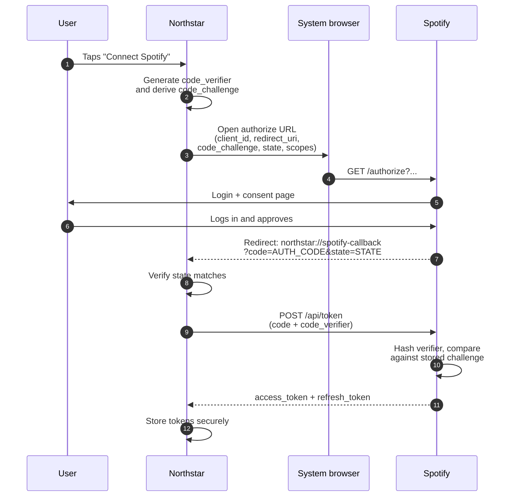
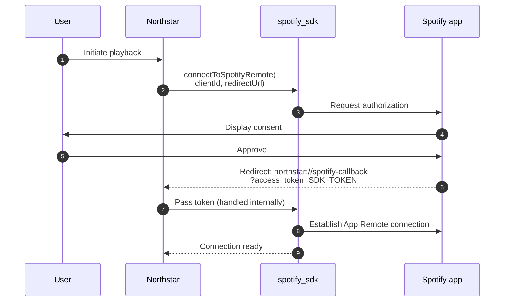

# Authentication

Spotify uses OAuth 2.0. Northstar implements the Authorization Code Flow with PKCE, which does not require a backend secret and is appropriate for a desktop or mobile client.

## Required scopes

| Scope | Purpose | Platform |
|---|---|---|
| `streaming` | Use the Web Playback SDK to play audio within Northstar | Desktop only |
| `user-read-email` | Required by the Web Playback SDK for SDK initialisation | Desktop only |
| `user-read-private` | Required by the Web Playback SDK for SDK initialisation | Desktop only |
| `user-read-playback-state` | Read the current playback state (track, position, device) | All |
| `user-modify-playback-state` | Control playback: play, pause, skip, seek, set volume | All |
| `user-read-currently-playing` | Poll the currently playing track during Discovery mode | All |
| `playlist-read-private` | Read the user's private playlists for import | All |
| `playlist-read-collaborative` | Read collaborative playlists for import | All |
| `user-library-read` | Read the user's saved tracks and albums for import | All |

## Token lifecycle

Access tokens expire after one hour. Northstar refreshes the token automatically using the refresh token before expiry. With PKCE, the token refresh response may include a new refresh token — Northstar must store it if returned, as the previous token is invalidated. If the refresh fails, the session is invalidated and the user is prompted to re-authenticate.

## Authorization flow

Northstar uses two distinct Spotify auth mechanisms depending on what it needs to do.

### PKCE — Web API token (all platforms)

The PKCE flow runs once when the user first connects their Spotify account and produces the token used for all Web API calls: import, REST playback control, and Discovery mode polling.

1. Northstar generates a cryptographically random code verifier and derives the code challenge (SHA-256, base64url-encoded).
2. Northstar opens Spotify's authorization endpoint in the system browser, with all required parameters:
   ```
   https://accounts.spotify.com/authorize
     ?response_type=code
     &client_id=CLIENT_ID
     &redirect_uri=northstar%3A%2F%2Fspotify-callback
     &scope=streaming%20user-read-email%20user-library-read%20...
     &code_challenge_method=S256
     &code_challenge=HASHED_VERIFIER
     &state=RANDOM_STATE
   ```
3. The user grants access in Spotify's login page. Spotify redirects to the registered redirect URI with the authorization code:
   ```
   northstar://spotify-callback?code=AUTH_CODE&state=RANDOM_STATE
   ```
4. Northstar verifies the `state` value matches what it sent in step 2, then exchanges the code for tokens:
   ```
   POST https://accounts.spotify.com/api/token
   Content-Type: application/x-www-form-urlencoded

   grant_type=authorization_code
   &code=AUTH_CODE
   &redirect_uri=northstar%3A%2F%2Fspotify-callback
   &client_id=CLIENT_ID
   &code_verifier=ORIGINAL_VERIFIER
   ```
5. Northstar stores both tokens securely on device. All required scopes are requested in a single authorization — the user grants all permissions upfront.



### App Remote SDK auth — SDK connection token (mobile only)

On iOS and Android, the App Remote SDK requires a separate token to initialize the SDK connection to the Spotify app. The Spotify iOS/Android SDKs handle this flow internally via `spotify_sdk`'s `connectToSpotifyRemote()`. The Spotify app is opened (or the user is prompted to install it), and a token is returned directly in the redirect — no code exchange step:

```
northstar://spotify-callback?access_token=SDK_TOKEN&...
```

This token is used exclusively for the SDK connection and is distinct from the Web API token. Both redirect types land at `northstar://spotify-callback` — Northstar's URL scheme handler distinguishes them by their parameters: the PKCE redirect contains `code` and `state`; the App Remote redirect contains the SDK token directly.



## Redirect URIs

| Platform | Redirect URI | Mechanism |
|---|---|---|
| iOS | `northstar://spotify-callback` | Custom URL scheme. The OS routes the redirect back to the Northstar app. Handles both PKCE and App Remote SDK redirects. |
| Android | `northstar://spotify-callback` | Custom URL scheme registered via Android intent filter. Handles both redirect types. |
| Desktop | `http://127.0.0.1:{PORT}/callback` | Northstar is served from a fixed loopback address. Spotify redirects back to the same origin; the app reads the authorization code from URL query parameters. |

All redirect URIs must be registered in the Spotify developer dashboard. Spotify requires exact matches — the loopback address must use `127.0.0.1`, not `localhost`, and a fixed port must be chosen at implementation time. The custom URL scheme must not conflict with other installed apps.
